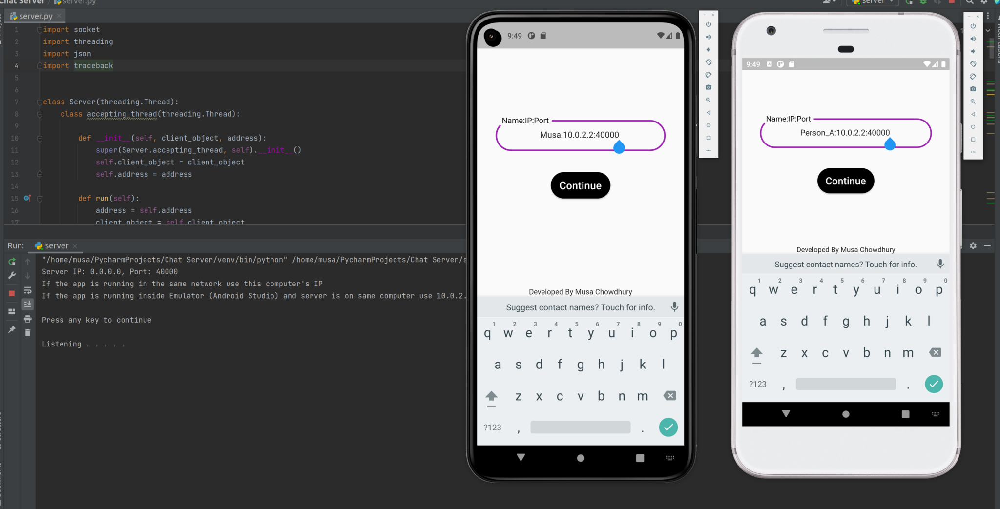
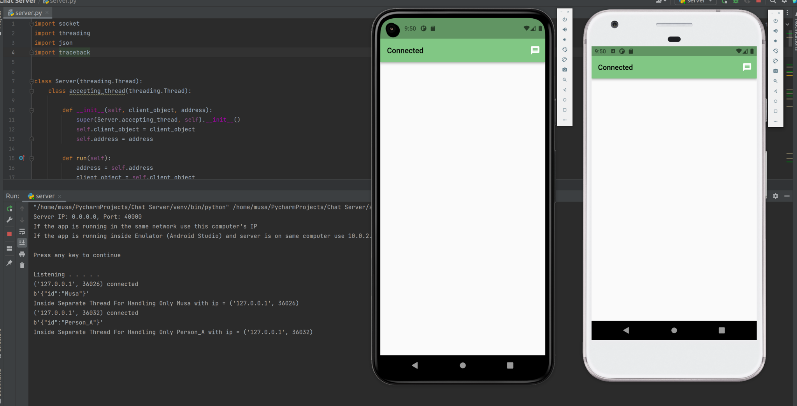
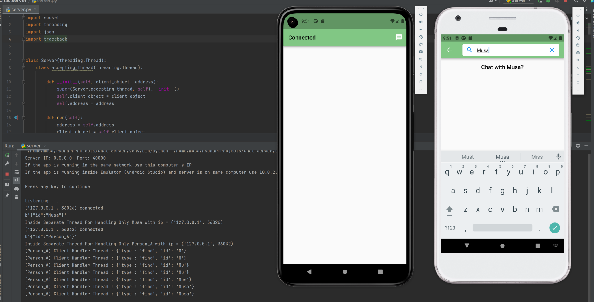
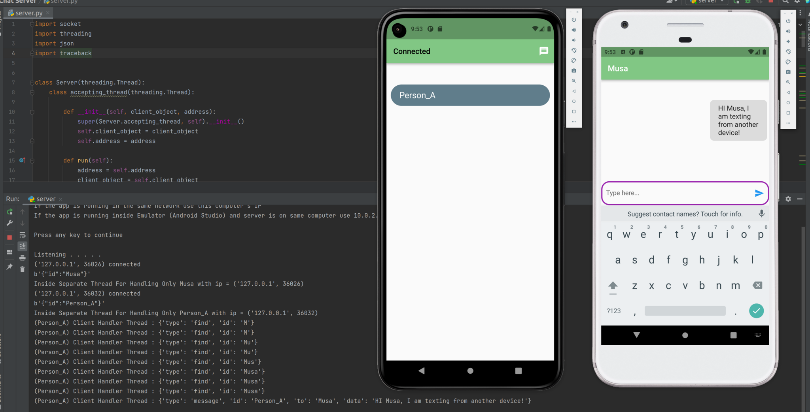
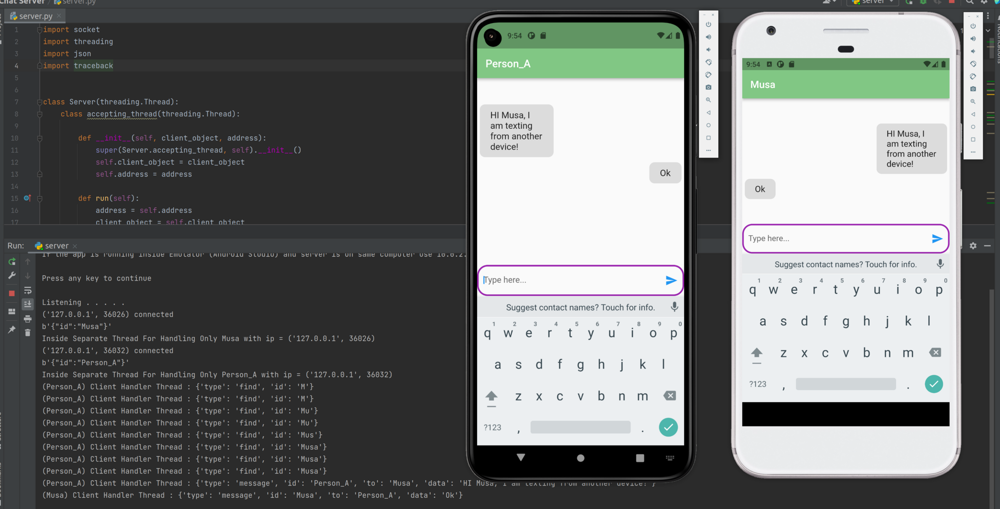

# About
The project is only made to play with tcp socket connection and flutter framework. No conventions or protocols are followed during data transactions.

 

# Features

<ul>
  <li> 
    
Both app(dart) and server(python3) are built with standard library. No dependencies

  </li>
    <li> 
    
Server mimics the properties "WebSocket" (clients connect with server using tcp and the connecting is kept alive for the whole time)

  </li>
    <li> 
    
Supports UTF-8

  </li>
    <li> 
    
Using tunneling software like "NGROK" the server can be assessed from public network (unsafe. data over the packets are not encrypted)

  </li>

</ul>

 

# Demo
During this demonstration "Flutter 3.7.7" and "Python 3.10" are used on "Ubuntu 22.10".
<ul>
    <li>
      
 <h2>Login</h2> 

      
    </li>
    <li>
      
 <h2>After Successful Connection</h2> 

      
    </li>
    <li>
      
 <h2>Searching for Another User By Name</h2> 

      
    </li>
    <li>
      
 <h2>Sending Message</h2> 

      
    </li>
    <li>
      
 <h2>Messaging From Both Sides</h2> 

      
    </li>

</ul>

 

# Steps To Build

<ul>
  <li> 
    
Install <a href="https://docs.flutter.dev/get-started/install">Flutter</a>.

  </li>
  <li> 
    
Install <a href="https://developer.android.com/studio">Android Studio</a>.

  </li>
  <li> 
    
Install <a href="https://www.jetbrains.com/pycharm/">PyCharm</a>.

  </li>
  <li> 
    
Install plugins for android studio.

  </li>
  <li> 
    
Create new project in both pycharm and flutter(android studio).

  </li>
  <li> 
    
Copy codes of server.py to pycharm project and main.dart(flutter app source) to flutter project.

  </li>
  <li> 
    
Configure android virtual devices and connect to server using IP "10.0.2.2" if server is running on same computer. Port is 40000. User name must be unique.

  </li>
  <li> 
    
If you want to test the app from physical android device make sure to follow this <a href="https://stackoverflow.com/questions/55603979/why-cant-a-flutter-application-connect-to-the-internet-when-installing-app-rel">link </a>.

  </li>
</ul>

 
